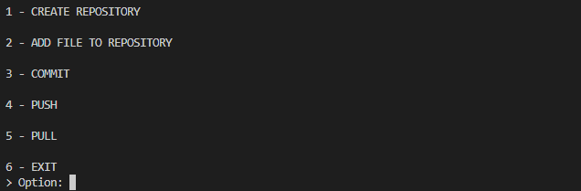
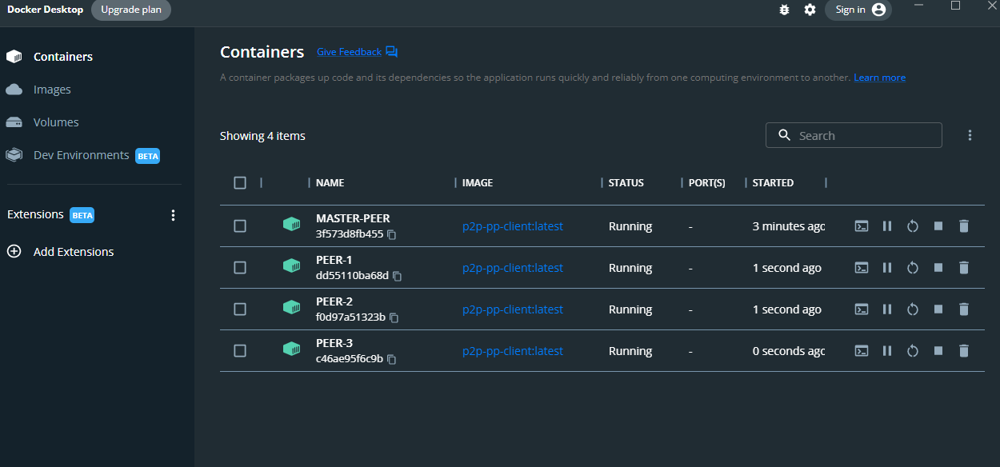

# GitProtocol

Progetto accademico di [**Ciro Perfetto**](https://github.com/ciroperf)

Corso di Laurea Magistrale in informatica: **Architetture distribuite per il Cloud**

Professori: **Alberto Negro** **Carmine Spagnuolo** **Gennaro Cordasco**

[Dipartimento di Informatica](http://www.di.unisa.it) - [Università degli Studi di Salerno](https://www.unisa.it/) (Italia)

## Definizione del problema

In questo progetto è stata creata un'implementazione del protocollo Git, utilzzando una rete P2P. Ciascun peer di questa rete può gestire i suoi progetti(un insieme di file) usando il protocollo Git, in una sua versione basilare. Il sistema permette all'utente di creare una nuova repository in una cartella specifica, aggiungere nuovi file per essere tracciati dal sistema, applicare cambiamenti sulla repository locale (funzione di commit), fare il push dei cambiamenti della rete, e fare il pull dei cambiamenti dalla rete. Il protocollo git ha un comportamento specifico per gestire i conflitti che verranno poi gestiti manualmente.


## Soluzione del progetto

Il perno principale su cui si basa il progetto è l'uso di una DHT (distributed hash table) che viene usata per poter salvare coppie chiave-valore contenenti il nome della repository e la classe GitRepository, che è un ogetto serializzabile, per poterne salvare lo stato.
La classe GitRepository ha come attributi: una lista di file, un'hashmap di una coppia di File e array di byte, una lista di commit (anch'essi una classe), il nome della repository, il percorso della directory dove è salvata la repository e una stringa per salvare il digest.

Vediamo ora nel dettaglio a cosa servono alcuni campi:

- La lista di File serve a tenere traccia dei file in locale della repository, necessaria sia in fase di inizializzazione per poter ottere i file già presenti nella directory della repository
- L'hashmap viene utilizzata per poter eseguire sia il push che il pull. Per ogni file presente nella lista di file viene inserita come chiave in questa hashmap l'oggetto file (così è possibile ottenere il percorso dove salvare il file) come chiave e i byte del file come valore. Quindi viene utilizzata questa hashmap per poter tenere traccia degli aggiornamenti sulla rete
- La lista di commit serve per poter analizzare il timestamp dei commit sulla repo e dei messaggi facoltativi da inserire quando viene eseguito un commit. I commit contengono anche il digest dei file presenti nella directory, in modo da individuare eventuali confitti.
- Il digest serve per poter gestire i conflitti sia con l'operazione di push che di pull. Quando i file vengono confrontati viene analizzato il digest che sarebbe l'md5 della SequenceInputStream di tutti i file presenti nella repository. Così facendo è possibile individuare facilmente eventuali cambiamenti sui file e richiedere agli utenti, per esempio, di eseguire il pull prima di poter eseguire una push

### Interfaccia testuale

All'avvio dell'app è possibile scegliere le operazioni da eseguire tramite un menu testuale:



- "CREATE REPOSITORY" viene utilizzato per creare una repository nel percorso specificato, in cui deve essere presente una directory
- "ADD FILES TO REPO" viene utilizzato per poter inserire i file nell'array di file della classe GitRepo, questa operazione deve essere effettuata prima di eseguire un commit
- "COMMIT" viene usato per prelevare i file dalla lista di file, estrarne i digest e inserirli nella lista locale dei file della repository
- "PUSH" viene usato per inserire sulla dht l'ogetto GitRepository che contiene la lista dei file presenti in locale e il commit. 
- "PULL" viene usato per prendere dalla dht l'oggetto GitRepository già presente sulla repository e aggiornare i file locali grazie all'hashmap dei file.

### Docker

E' possibile instanziare l'app sul docker tramite il dockerfile contenente le informazioni.
Per prima cosa viene creata l'immagine tramite questa linea di comando:

```
docker build --no-cache -t p2p-pp-client .
```

Dopo aver buildato l'immagine è possibile istanziare i container tramite questa linea

```
docker run -i --name MASTER-PEER -e MASTERIP="127.0.0.1" -e ID=0 p2p-pp-client
```

Così facendo viene creato il peer master. Gli altri peer possono essere instanziati utilizzando l'ip del master:

```
docker run -i --name PEER-1 -e MASTERIP="172.17.0.2" -e ID=1 p2p-pp-client    
```

Se si vuole rieseguire un peer qualsiasi basta poi digitare solo questo comando (nell'esempio viene usato il master peer)

```
docker start -i MASTER-PEER    
```

Inizializzazione dell'ambiente con 4 peer



### Test


